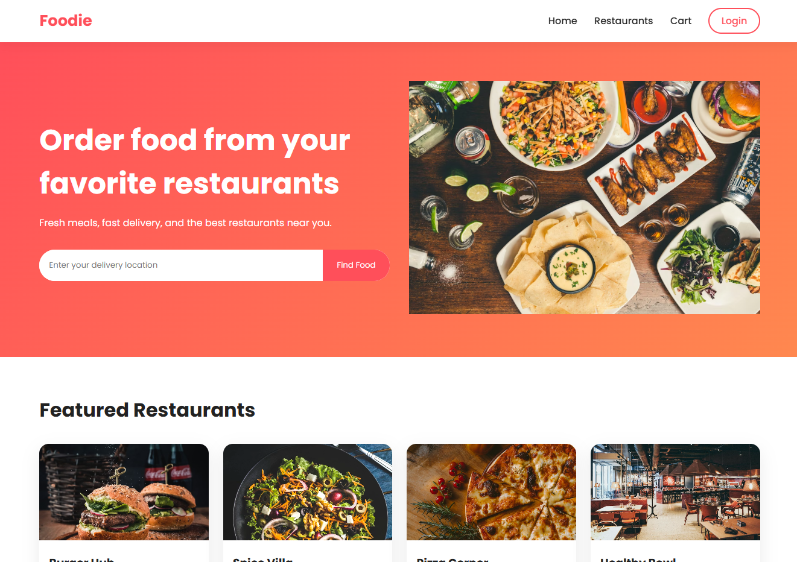
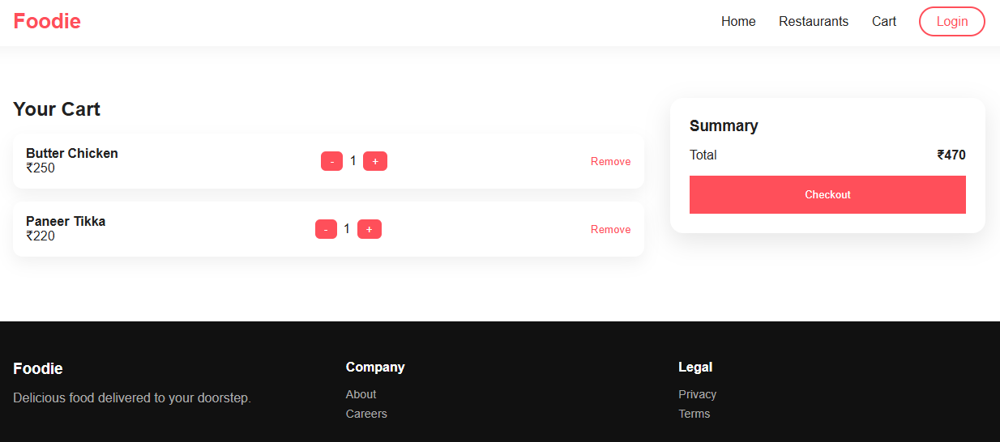

# 🍔 Food Delivery Prototype

A simple food delivery app prototype inspired by platforms like Swiggy and Zomato. This project focuses on UI flow and basic functionality such as browsing restaurants, viewing menus, and placing orders.

## 🚀 Features

- Browse restaurants  
- View menu items  
- Add items to cart  
- Basic order placement flow  
- Clean and simple UI  

## 🛠️ Tech Stack

- HTML, CSS, JavaScript, JSON

## 📸 Screenshots

  

## 📂 Project Structure

assets → UI images and resources  
scripts → logic and functionality  
scenes → main app screens  

## ⚙️ How to Run

Clone the repository:

git clone https://github.com/your-username/your-repo-name.git

Then open the project in:
- Unity Hub / Android Studio / Browser

Run the project.

## 🎯 Purpose

Built as a learning project to understand:
- UI/UX design
- App flow
- Basic functionality of food delivery systems

## ⚠️ Limitations

- No real backend
- No payment integration
- Uses static/mock data

## 🔮 Future Improvements

- Add backend (Firebase / Node.js)
- User login system
- Live order tracking
- Payment gateway integration

